# NodOn Zigbee Bridge

> **New Release — NodOn OS v0.72.1**
>
> Zigbee2MQTT has been upgraded to **v2.8.0**, along with minor improvements and bug fixes.
> **[Download firmware update](https://github.com/Altyor/NodOn-Zigbee-Bridge/releases/download/v0.72.1/firmware-0.72.1.fwpkg)** | [Release notes](https://github.com/Altyor/NodOn-Zigbee-Bridge/releases/tag/v0.72.1)
>
> See [How to Update Your Bridge](#how-to-update-your-bridge) for installation instructions.

## Table of Contents

- [What is the NodOn Zigbee Bridge?](#what-is-the-nodon-zigbee-bridge)
- [How It Works](#how-it-works)
- [Getting Started](#getting-started)
  - [Step 1 — Power the Device](#step-1--power-the-device)
  - [Step 2 — Find Your Device's IP Address](#step-2--find-your-devices-ip-address)
  - [Step 3 — Access the Web Interface](#step-3--access-the-web-interface)
  - [Step 4 — Create Your Password](#step-4--create-your-password)
- [Adding Your First Zigbee Device](#adding-your-first-zigbee-device)
- [MQTT Broker Modes](#mqtt-broker-modes)
  - [Standalone Mode — Single Bridge Setup](#standalone-mode--single-bridge-setup)
  - [Multi-Bridge Mode — Centralized Multi-Site Deployment](#multi-bridge-mode--centralized-multi-site-deployment)
  - [External Broker Mode — Use Your Own MQTT Server](#external-broker-mode--use-your-own-mqtt-server)
  - [Which Mode Should I Use?](#which-mode-should-i-use)
- [MQTT Security](#mqtt-security)
- [Controlling Zigbee2MQTT via MQTT](#controlling-zigbee2mqtt-via-mqtt)
  - [How Topics Work](#how-topics-work)
  - [Examples](#examples)
  - [Full Documentation](#full-documentation)
- [Note for Home Assistant Users](#note-for-home-assistant-users)
- [How to Update Your Bridge](#how-to-update-your-bridge)
- [Need Help?](#need-help)

---

> **Beta Notice**
>
> Thank you for participating in the NodOn Zigbee Bridge beta program! This device is provided for **testing purposes only**. Please note:
> - This is **not yet production-ready** — security features are still being hardened
> - Some features may change before final release
> - Your feedback is invaluable — use the **"Beta Feedback"** button in the webapp sidebar to contact us directly

---

## What is the NodOn Zigbee Bridge?

**The NodOn Zigbee Bridge is a plug-and-play Zigbee-to-MQTT gateway.** It captures data from your Zigbee devices (sensors, switches, actuators...) and makes them available over MQTT — the standard protocol used by Building Management Systems (BMS), SCADA platforms, Home Assistant, and any MQTT-compatible automation software.

**Key benefits:**

- **No cloud, no subscription** — Everything runs locally on the device. Your data stays on your network.
- **Built-in MQTT broker** — Mosquitto runs directly on the bridge. No need to set up a separate broker (though you can connect to your existing infrastructure if you prefer).
- **Powered by Zigbee2MQTT** — Industry-standard open-source Zigbee stack supporting 4000+ devices from 400+ manufacturers.
- **Web management interface** — Configure, monitor, and manage everything from your browser.
- **Flexible connectivity** — Power via USB-C or PoE. Network via Ethernet.
- **Scalable multi-bridge deployments** — A single Zigbee2MQTT instance can become resource-intensive (RAM, CPU) as the number of devices grows. Deploying multiple bridges spreads the load across dedicated hardware, while communicating between bridges via MQTT — which is far more lightweight. This keeps each bridge responsive even in large networks.
- **Centralized multi-site management** — Deploy bridges on-site at different physical locations and connect them all to a central BMS or cloud gateway. Manage multiple buildings, offices, or sites from a single dashboard, anywhere.

## How It Works

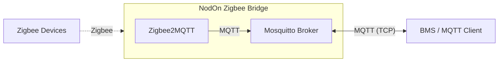

Your Zigbee devices communicate wirelessly with the bridge. Zigbee2MQTT translates Zigbee messages into MQTT topics. The built-in Mosquitto broker makes these available to any MQTT client on your network — whether it's a BMS, a cloud platform, or a home automation system.

---

## Getting Started

### Step 1 — Power the Device

Connect power using **one** of these options:

| Method | Details |
|--------|---------|
| **USB-C** | Connect a USB-C cable to any 5V USB power source |
| **PoE** | Connect an Ethernet cable from a PoE switch or injector |

Connect the bridge to your network via **Ethernet**. The device will boot automatically — wait approximately 1-2 minutes for the first boot.

### Step 2 — Find Your Device's IP Address

The bridge obtains an IP address via DHCP on your local network. To find it:

**Option A — Check your router / DHCP server:**
1. Log into your router or DHCP server admin interface
2. Look for connected devices / DHCP leases
3. Find the device matching the **MAC address** printed on your device label

**Option B — Use a network scanner:**
Use a tool like [Fing](https://www.fing.com/) (mobile app) or `nmap` to scan your local network.

### Step 3 — Access the Web Interface

1. Open a web browser
2. Navigate to `http://<your-device-ip>`
3. You will see the password setup screen

### Step 4 — Create Your Password

On first access, you'll be prompted to create a password:

1. Enter a password (minimum 8 characters)
2. Confirm your password
3. Click **"Create Password & Continue"**

You will be redirected to the login page. Enter your password to access the dashboard.

> **Important:** There is currently no password reset feature. Make sure to save your password securely.

### You're Ready!

Once logged in, you have access to:

- **Dashboard** — Real-time system monitoring (CPU, RAM, Disk)
- **Zigbee2MQTT** — Full Zigbee device management frontend
- **Services** — Configure and manage Zigbee2MQTT and the MQTT broker
- **Configuration** — Network, timezone, and system settings
- **Firmware Update** — Over-the-air firmware updates

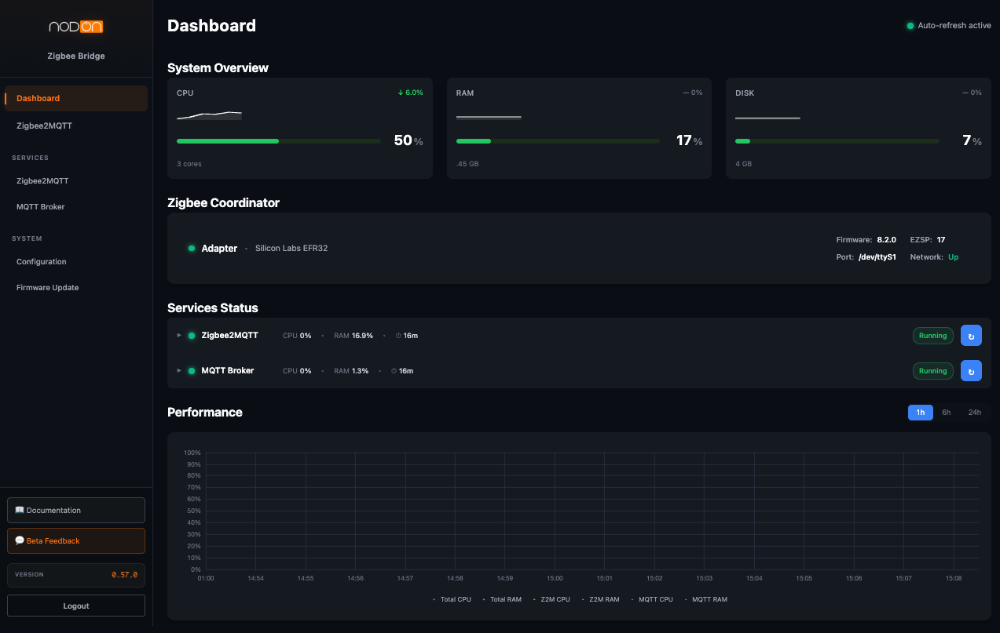

---

## Adding Your First Zigbee Device

Once your bridge is up and running, you can start pairing Zigbee devices.

### From the Web Interface

1. Open the bridge's web interface (`http://<your-device-ip>`)
2. Click **Zigbee2MQTT** in the sidebar to open the Zigbee2MQTT frontend
3. Click the **"Permit join (All)"** button at the bottom of the sidebar (this opens a 2-minute pairing window)
4. Put your Zigbee device into **pairing mode** (usually by holding its button for 5-10 seconds — check your device's manual)
5. The device should appear in the Zigbee2MQTT device list within a few seconds
6. Once paired, you can rename it, configure it, and start using it

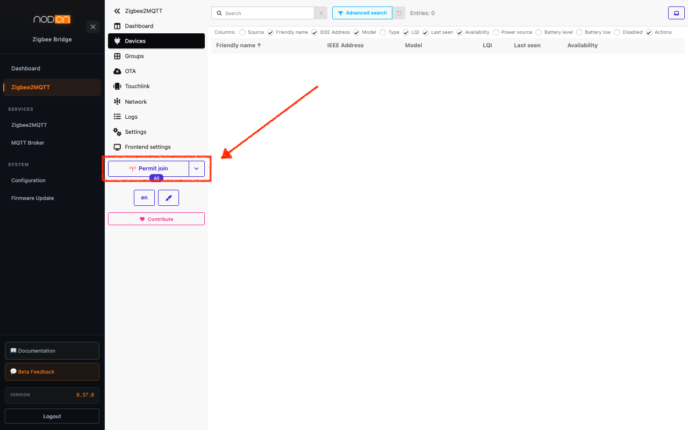

### Via MQTT

You can also trigger permit join programmatically from your BMS or any MQTT client. See [Controlling Zigbee2MQTT via MQTT](#controlling-zigbee2mqtt-via-mqtt) for details.

### Supported Devices

Zigbee2MQTT supports over **4000 devices** from **400+ manufacturers**. Check if your device is compatible:

- **Supported Devices List**: [zigbee2mqtt.io/supported-devices](https://www.zigbee2mqtt.io/supported-devices/)

---

## MQTT Broker Modes

The NodOn Zigbee Bridge offers three MQTT broker modes to adapt to different deployment scenarios. You can switch between modes at any time from the web interface under **MQTT Broker Service > Mode**.

| Mode | Local Broker | Best For |
|------|:---:|----------|
| **Standalone** | Active | Single bridge, simple setup |
| **Multi-Bridge** | Active | Multiple bridges, centralized access |
| **External Broker** | Disabled | Existing MQTT infrastructure (BMS, cloud, etc.) |

---

### Standalone Mode — Single Bridge Setup

**When to use:** You have a single bridge covering a building or zone and want to connect it to your BMS, automation platform, or any MQTT client.

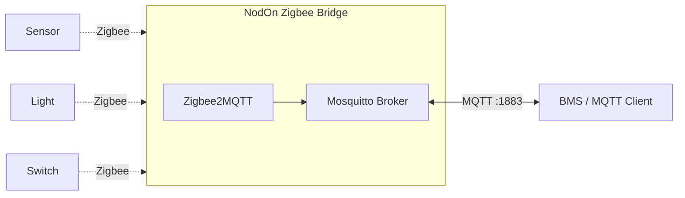

This is the simplest setup. The bridge runs its own MQTT broker. Your automation system connects directly to it.

**Integration:** Connect any MQTT client to `<bridge-ip>:1883` and subscribe to `zigbee2mqtt/#` to receive all device data. See [Controlling Zigbee2MQTT via MQTT](#controlling-zigbee2mqtt-via-mqtt) for how to manage devices programmatically.

**Configuration options:**
- **Base topic** — Change the MQTT topic prefix (default: `zigbee2mqtt`)

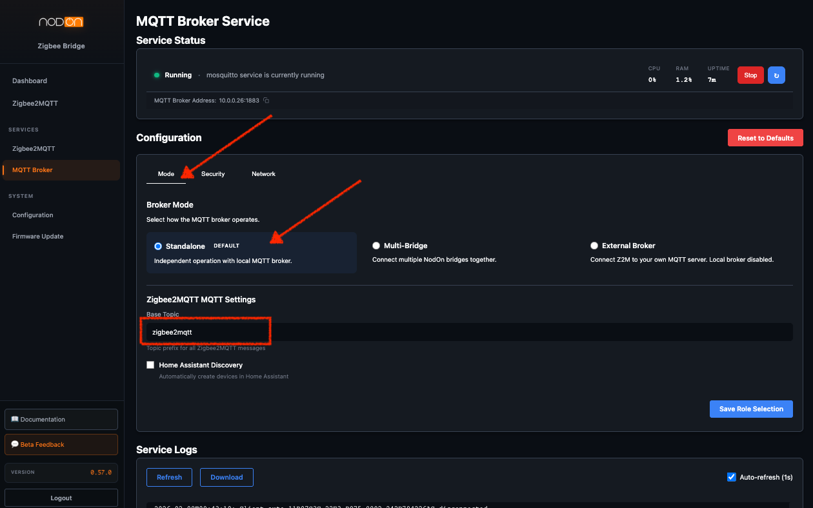

---

### Multi-Bridge Mode — Centralized Multi-Site Deployment

**When to use:**

- **Large Zigbee networks** — A single Zigbee2MQTT instance can consume significant resources (RAM, CPU) as the device count grows. Splitting devices across multiple bridges keeps each one responsive, while MQTT handles inter-bridge communication with minimal overhead.
- **Single broker limitation** — Your BMS or automation platform can only connect to **one MQTT broker**. The Aggregator becomes that single broker, unifying all bridges.
- **Multi-site deployments** — Deploy bridges at different physical locations (offices, buildings, warehouses) and connect them all to a central BMS or cloud gateway. Manage multiple sites from a single MQTT connection.

**The solution:** One bridge acts as the **Aggregator** (central hub), the others act as **Sources** (forwarding their data to it). Your BMS connects only to the Aggregator.

#### How It Works

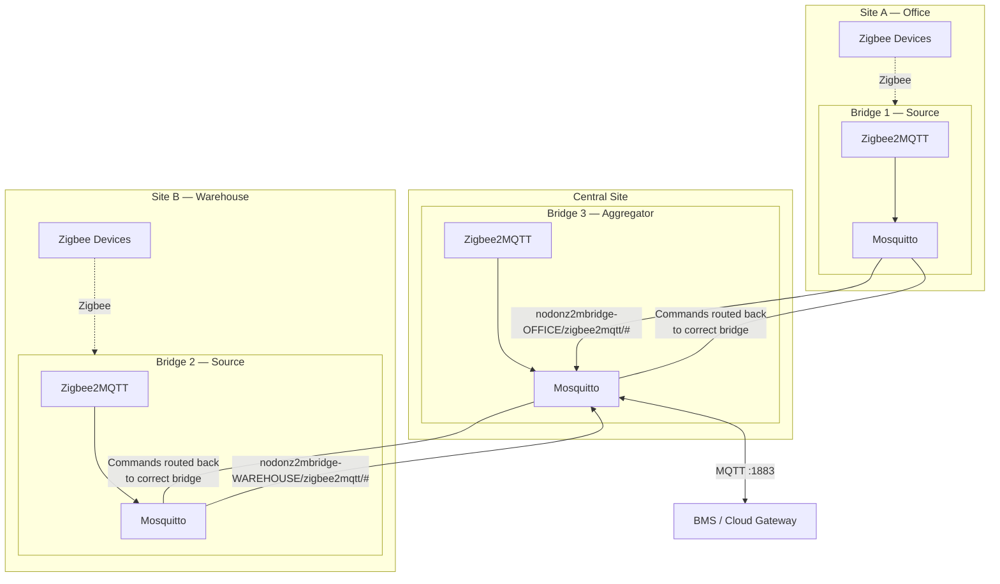

#### Topic Prefixing

Each Source bridge prefixes its MQTT topics with a unique identity, so the Aggregator (and your BMS) can distinguish which bridge a device belongs to:

| Source Bridge | Local Topic | Topic on Aggregator |
|---------------|-------------|---------------------|
| Office (OFFICE) | `zigbee2mqtt/temp_sensor` | `nodonz2mbridge-OFFICE/zigbee2mqtt/temp_sensor` |
| Warehouse (WAREHOUSE) | `zigbee2mqtt/motion_1` | `nodonz2mbridge-WAREHOUSE/zigbee2mqtt/motion_1` |

The bridge identity follows the format `nodonz2mbridge-XXXXXX` where the suffix is the last 6 characters of the MAC address by default, or a custom name you configure.

#### Bidirectional Routing

The connection is **bidirectional**. When your BMS sends a command to a specific bridge's topic, the Aggregator routes it back to the correct Source:

```
Your BMS → publishes to: nodonz2mbridge-OFFICE/zigbee2mqtt/light/set {"state": "ON"}
                    ↓
            Aggregator receives it
                    ↓
            Routes to Source "OFFICE"
                    ↓
            Office bridge controls the light
```

This means you can **monitor and control all devices across all sites from a single MQTT connection**.

#### Configuration

**Step 1 — Set up the Aggregator bridge:**
1. Go to **MQTT Broker Service > Mode**, select **Multi-Bridge > Aggregator**, click **Save**
2. Go to the **Security tab**, create a dedicated MQTT user for each Source bridge (e.g., `bridge-floor1`, `bridge-floor2`). Using one user per Source is recommended for traceability and security.

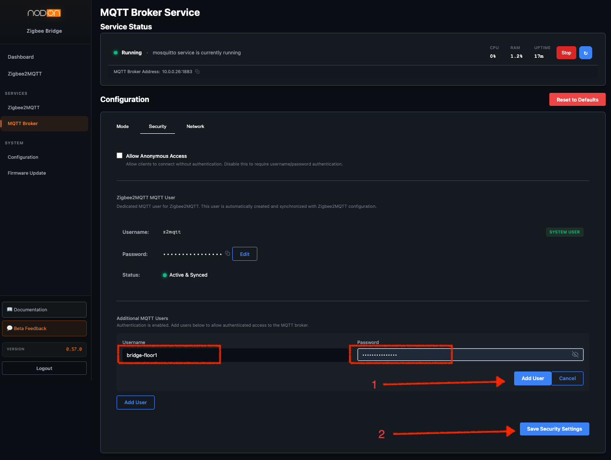

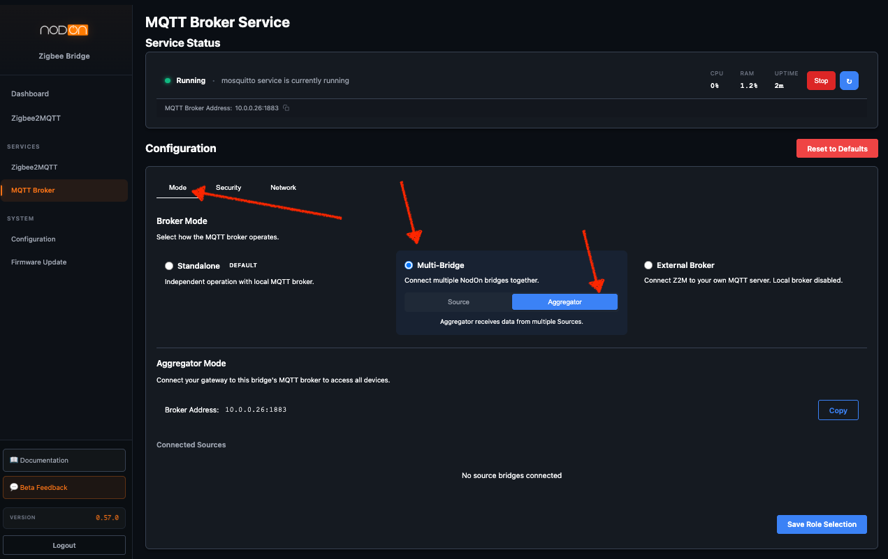

**Step 2 — Set up each Source bridge:**
1. Go to **MQTT Broker Service > Mode**, select **Multi-Bridge > Source**
2. Enter the Aggregator's IP address and port
3. Enable authentication and enter the credentials created in Step 1
4. Use **Test Connection** to verify connectivity
5. Click **Save & Apply**

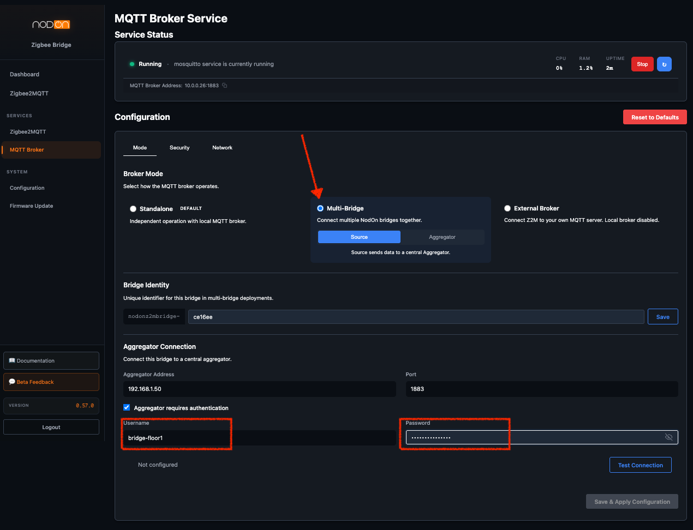

**Step 3 — Verify:**
On the Aggregator, the **Connected Sources** panel shows each connected Source bridge with its status.

---

### External Broker Mode — Use Your Own MQTT Server

**When to use:** You already have an MQTT broker running in your infrastructure — whether it's a dedicated Mosquitto instance, a cloud MQTT service, or a broker embedded in your BMS. Instead of running a second broker on the bridge, you connect Zigbee2MQTT directly to your existing one.

This is especially useful with **multiple bridges**: each bridge connects to your central broker using a **unique base topic** (e.g., `zigbee2mqtt-floor1`, `zigbee2mqtt-floor2`) to avoid conflicts, while your BMS has a single MQTT connection point.

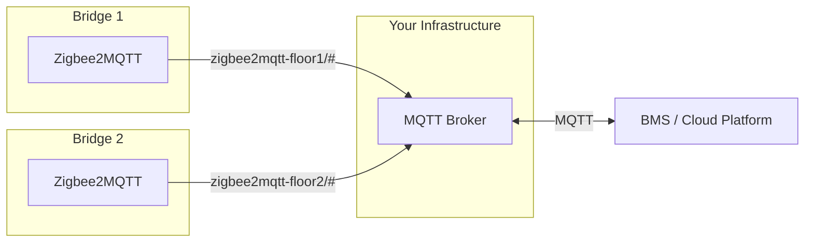

Each bridge's local Mosquitto service is disabled — your existing broker handles everything.

**Configuration:**
1. Go to **MQTT Broker Service > Mode**, select **External Broker**
2. Enter your broker's address and port
3. If your broker requires authentication, provide credentials
4. **Change the base topic** to something unique per bridge (e.g., `zigbee2mqtt-building-a`)
5. Use **Test Connection** to verify connectivity
6. Click **Save & Apply**

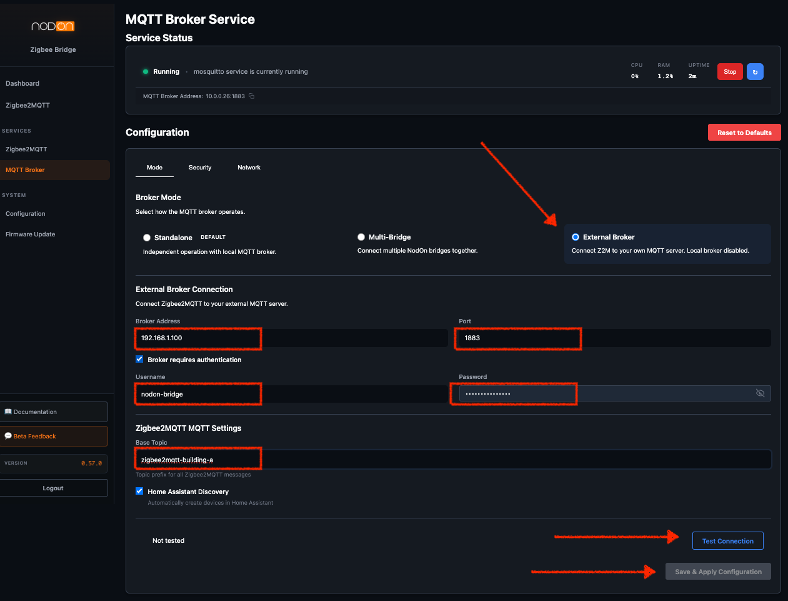

---

### Which Mode Should I Use?

| Scenario | Recommended Mode |
|----------|-----------------|
| Single bridge, simple setup | **Standalone** |
| Multiple bridges, no existing broker | **Multi-Bridge** (Source + Aggregator) |
| Multiple bridges across different physical sites | **Multi-Bridge** (Source + Aggregator) |
| Multiple independent bridges, maximum resilience (no inter-bridge dependency) | **Standalone** on each bridge + External Broker or direct BMS connection |
| Already running your own MQTT broker or BMS | **External Broker** |
| Multiple bridges with Home Assistant | **External Broker** (see [note below](#note-for-home-assistant-users)) |

---

## MQTT Security

The bridge supports **MQTT authentication** with username/password credentials. You can manage MQTT users from the web interface under **MQTT Broker Service > Security**:

- **Create dedicated users** for each client connecting to the broker (BMS, other bridges, monitoring tools)
- **Disable anonymous access** to require authentication for all MQTT connections
- Passwords are securely hashed (PBKDF2-SHA512)

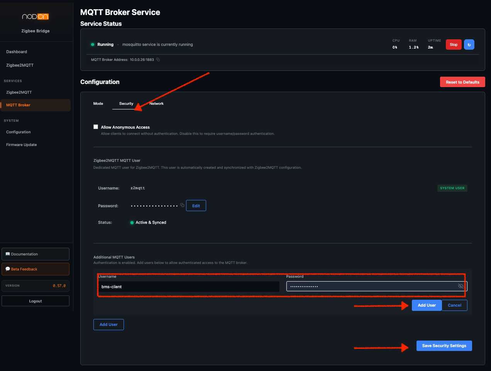

> **MQTT over TLS (MQTTS):** Encrypted MQTT connections via TLS will be available before the final release. This will allow secure communication between bridges and your BMS over untrusted networks.

---

## Controlling Zigbee2MQTT via MQTT

Zigbee2MQTT exposes all device data and management capabilities through MQTT topics. This means you can monitor and control your Zigbee devices from **any MQTT client** — your BMS, a custom application, or a cloud platform.

### How Topics Work

All Zigbee2MQTT messages are published under the base topic (default: `zigbee2mqtt/`):

```
zigbee2mqtt/                     # Bridge status and info
zigbee2mqtt/bridge/state         # "online" or "offline"
zigbee2mqtt/bridge/devices       # List of all paired devices
zigbee2mqtt/<device_name>        # Device state updates (temperature, state, battery...)
zigbee2mqtt/<device_name>/set    # Send commands to a device
zigbee2mqtt/<device_name>/get    # Request current state from a device
```

### Examples

**Allow new devices to join the network:**
```
Topic:   zigbee2mqtt/bridge/request/permit_join
Payload: {"value": true, "time": 120}
```

**Turn on a light:**
```
Topic:   zigbee2mqtt/living_room_light/set
Payload: {"state": "ON", "brightness": 200}
```

**Read a sensor's current value:**
```
Topic:   zigbee2mqtt/office_sensor/get
Payload: {"temperature": ""}
```

> **Note:** In Multi-Bridge mode, topics on the Aggregator are prefixed with the bridge identity. For example: `nodonz2mbridge-OFFICE/zigbee2mqtt/living_room_light/set`

### Full Documentation

Zigbee2MQTT offers extensive MQTT capabilities including device groups, binding, OTA updates, and more. For the complete reference, see the official documentation:

- **MQTT Topics & Messages**: [zigbee2mqtt.io/guide/usage/mqtt_topics_and_messages.html](https://www.zigbee2mqtt.io/guide/usage/mqtt_topics_and_messages.html)

---

## Note for Home Assistant Users

The NodOn Zigbee Bridge is fully compatible with **Home Assistant** via its MQTT integration.

**Home Assistant Compatibility** can be enabled in any mode from the web interface. When enabled, Zigbee2MQTT publishes Home Assistant MQTT discovery messages, giving Home Assistant full management capabilities — including device joining, removal, and configuration — not just device data. This option is enabled by default. See the official documentation: [zigbee2mqtt.io/guide/usage/integrations/home_assistant.html](https://www.zigbee2mqtt.io/guide/usage/integrations/home_assistant.html)

**Recommended setup for multiple bridges with Home Assistant:**

Use **External Broker mode** on each bridge, pointing to Home Assistant's Mosquitto add-on. Give each bridge a **unique base topic** (e.g., `zigbee2mqtt-floor1`, `zigbee2mqtt-floor2`). This is recommended because Home Assistant can only connect to a single MQTT broker, and it does not natively handle the topic prefixes used in Multi-Bridge mode.

For setting up the Mosquitto add-on in Home Assistant, see: [home-assistant.io/integrations/mqtt](https://www.home-assistant.io/integrations/mqtt/)

---

## How to Update Your Bridge

Firmware updates are delivered as `.fwpkg` files that you upload through the web interface.

1. **Download** the latest firmware file (`.fwpkg`) from the [Releases page](https://github.com/Altyor/NodOn-Zigbee-Bridge/releases)
2. Open your bridge's web interface (`http://<your-device-ip>`)
3. Go to **Firmware Update** in the sidebar
4. Click **Upload** and select the downloaded `.fwpkg` file
5. The bridge will validate, install, and reboot automatically — this takes a few minutes

> **Note:** Do not power off the bridge during the update process.

---

## Need Help?

We're here to support you during the beta:

1. Click the **"Beta Feedback"** button in the webapp sidebar
2. Describe your issue or suggestion
3. We'll get back to you as soon as possible

**Thank you for helping us build a better product!**

*The NodOn Team*
